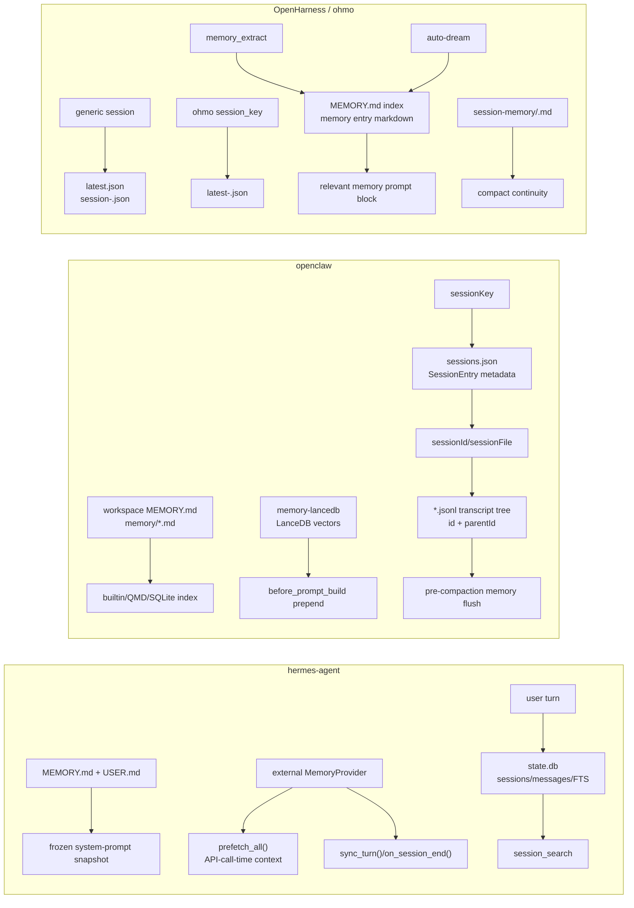
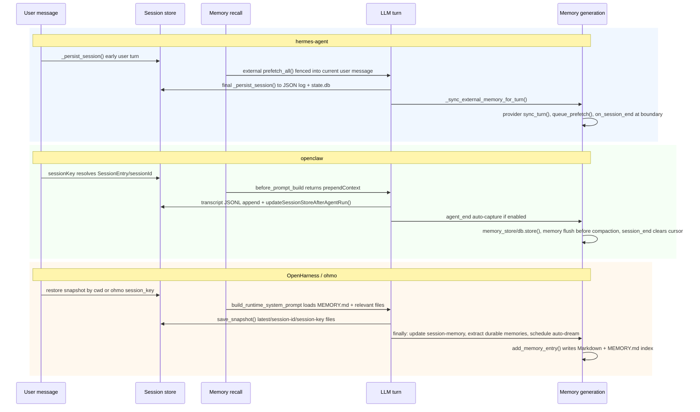

# Agent 框架 Memory 与 Session 管理调研

本调研面向当前仓库中的三个项目：`hermes-agent`、`openclaw`、`OpenHarness/ohmo`。结论基于仓库源码和项目内文档的只读核查；重点回答两个问题：

- 这些项目如何管理 memory 与 session。
- 这些项目如何生成、写入或提炼 memory。

先给核心结论：三者都把 **session** 和 **memory** 分层，但“memory”一词在不同项目里指向不同对象。Session 通常是当前/历史对话与运行状态的账本；memory 是跨 session 可复用的知识层。最大的差异在于：OpenClaw 以 session store + JSONL transcript tree 为主，并通过插件/Markdown memory 层召回；OpenHarness 以 JSON snapshot 恢复 session，并用 Markdown memory 文件做长期记忆；Hermes 以 SQLite `state.db` 做 session 主账本，内置 memory 则是冻结进 system prompt 的小型 Markdown 快照。

## 总览对比

| 项目 | Session 主体 | Memory 主体 | Memory 注入时机 | Memory 生成方式 |
| --- | --- | --- | --- | --- |
| `hermes-agent` | `$HERMES_HOME/state.db` SQLite，含 `sessions`、`messages`、FTS 表 | `$HERMES_HOME/memories/MEMORY.md`、`USER.md`；外部 provider 可扩展 | 内置 memory 在 session prompt 构建时冻结；外部 provider 在每轮 API call 前注入 user message | 内置 `memory` tool 显式写入；外部 provider 通过 `sync_turn()`、`on_session_end()`、provider tools 提炼或提交 |
| `openclaw` | `sessions.json` 元数据 + append-only JSONL transcript tree | workspace `MEMORY.md`/`memory/*.md` 的 builtin/index memory；可选 `memory-lancedb` 向量库 | workspace/builtin memory 由 prompt/context/search 体系加载；`memory-lancedb` 在 `before_prompt_build` prepend | `memory-lancedb` 的 `memory_store` tool、`agent_end` auto-capture；compaction 前 memory flush 写文件；dreaming/REM 可推广长期记忆 |
| `OpenHarness/ohmo` | generic OpenHarness JSON snapshot；ohmo 按 `session_key` 保存 `latest-<hash>.json` | Markdown `MEMORY.md` index + memory entry files；ohmo 有独立 `.ohmo/memory/` | runtime system prompt 加载 memory index，并按最新用户问题选 relevant memories；ohmo prompt 加载 personal memory | `/memory add`/后端 `add_memory_entry()`；generic runtime 可选 `memory_extract`；auto-dream 做后台整理 |

## 对象关系图

## 生命周期对比

## hermes-agent

### 持久化介质

Hermes 的内置 memory 是小而精选的 Markdown 文件：`$HERMES_HOME/memories/MEMORY.md` 保存 agent notes、项目约定和环境事实，`$HERMES_HOME/memories/USER.md` 保存用户画像和偏好。`MemoryStore` 维护两套状态：`_system_prompt_snapshot` 是 session 开始时冻结的 prompt 快照；`memory_entries` / `user_entries` 是 tool 写入后的 live state。

Session 主账本是 `$HERMES_HOME/state.db`。`hermes_state.py` 中的 schema 包含 `sessions`、`messages`、`state_meta`、`compression_locks`，以及 `messages_fts` 和 `messages_fts_trigram`。这意味着 Hermes 不只是保存历史，还把历史做成可检索的 session database。

### Session 标识与恢复

`sessions` 表保存 session metadata：`id`、`source`、`user_id`、`model`、`model_config`、`system_prompt`、`parent_session_id`、`started_at`、`ended_at`、`cwd`、`title`、handoff/rewind/archive 等字段。`messages` 表保存完整消息流：`role`、`content`、`tool_calls`、`tool_name`、reasoning/codex 字段、平台 message id、active 标记等。

`run_conversation()` 每条用户消息运行一次。`build_turn_context()` 会先把本轮 user message append 到 working messages，并在模型调用前调用 `_persist_session()` 做 crash-resilient 持久化；turn 结束时 `finalize_turn()` 再调用 `_persist_session()`，把完整 user/assistant/tool 链写入 JSON log 和 SQLite。

### Memory 注入时机

内置 memory 在 system prompt 构建时注入，并且整个 session 内冻结。这是 Hermes prompt caching 设计的一部分：session 中途 `memory` tool 写入会立即落盘，但不会改变当前 session 的 system prompt snapshot。

外部 memory provider 不走这个冻结层。`MemoryManager.prefetch_all()` 在每轮开始前召回相关上下文，`conversation_loop.py` 把这段内容用 `<memory-context>` 包起来，只注入当前 API call 的 user message。源码注释明确说这不会 mutate `messages`，因此不会进入 session persistence。

### Memory 如何生成

Hermes 有两类生成路径：

- 内置 memory：模型调用 `memory` tool 执行 `add`、`replace`、`remove`、`read` 等操作，`MemoryStore` 在文件锁下重读、去重、扫描 threat patterns、检查字符上限，然后原子写入 `MEMORY.md` 或 `USER.md`。文档中有一处“没有 read action”的说法与实现提示存在张力，源码的阻断提示会建议用 `memory(action=read)` 检查被拦截条目。
- 外部 provider：`MemoryProvider` 定义 `prefetch()`、`sync_turn()`、`on_session_end()`、`on_session_switch()`、`on_pre_compress()`、`on_memory_write()` 等生命周期。`MemoryManager.sync_all()` 在后台单 worker 上顺序调用 provider 的 `sync_turn()`，把已完成 turn 交给 provider；真实提炼逻辑由 Hindsight、OpenViking、Mem0 等 provider 自己实现。

`_sync_external_memory_for_turn()` 会跳过 interrupted turn，避免把用户没看到的 partial response 或被中断工具链写成长久记忆。

### 与 Compaction 的关系

Hermes 的压缩与 session lineage 紧密相关。`compression_locks` 防止多个 agent 同时压缩同一 session；`parent_session_id` 串联压缩后续 session。外部 provider 可以在 `on_pre_compress()` 把压缩前需要保留的 insights 放进 compression summary prompt，也可以在 `on_session_switch()` 处理 `/resume`、`/branch`、`/reset`、compression 等 session id 旋转。

### 关键证据

- `hermes-agent/tools/memory_tool.py`：`MemoryStore`、`_system_prompt_snapshot`、文件锁、threat scan、字符上限。
- `hermes-agent/agent/memory_provider.py`：外部 provider 生命周期。
- `hermes-agent/agent/memory_manager.py`：`prefetch_all()`、`sync_all()`、`on_session_end()`、单 worker 后台写入。
- `hermes-agent/agent/turn_context.py`：turn 开始时早期 session persistence 和 external memory prefetch。
- `hermes-agent/agent/conversation_loop.py`：prefetch context 只注入当前 API user message。
- `hermes-agent/run_agent.py`：`_persist_session()`、`_flush_messages_to_session_db()`、`_sync_external_memory_for_turn()`。
- `hermes-agent/hermes_state.py`：SQLite session schema、FTS、compression locks。

## openclaw

### 持久化介质

OpenClaw 的 session 有两层：`sessions.json` 保存 mutable session metadata；`*.jsonl` transcript 保存实际 conversation tree。默认路径是 `~/.openclaw/agents/<agentId>/sessions/sessions.json` 和同目录下的 transcript 文件。

OpenClaw 的 memory 也有多层，容易混淆：

- bootstrap file memory：workspace 下的 `MEMORY.md`，以及 `memory/YYYY-MM-DD.md`、`DREAMS.md` 等文档化长期/工作记忆。
- builtin/index memory：`memory-core`/QMD/SQLite search 层，把 `MEMORY.md`、`memory/*.md`，以及部分 session 来源建索引，给 `memory_search` / `memory_get` 等能力使用。
- plugin long-term memory：例如 bundled `memory-lancedb`，用 LanceDB 存向量化 `MemoryEntry`，提供 `memory_recall`、`memory_store`、`memory_forget` 和自动召回/捕获。

### Session 标识与恢复

OpenClaw 显式区分 `sessionKey` 和 `sessionId`。`sessionKey` 是路由和隔离 bucket，例如 main DM、channel peer、group/thread、cron 等；`sessionId` 是当前 transcript/run 的 id，会因 `/new`、`/reset`、daily/idle reset、compaction 等改变。

`SessionEntry` 很宽，除了 `sessionId`、`updatedAt`、`sessionFile`，还保存 `pluginExtensions`、`pluginNextTurnInjections`、subagent spawn lineage、tool allow/deny、model/provider override、usage/context tokens、compaction checkpoints、`memoryFlushAt`、`memoryFlushCompactionCount`、`memoryFlushFailureCount` 等字段。

Transcript 是 append-only JSONL tree。`SessionManager` 的 entry 带 `id` 与 `parentId`；`message`、`custom_message`、`compaction`、`branch_summary`、`label`、`session_info` 等 entry 类型共同组成可分支的 conversation tree。当前 LLM 上下文不是简单读取全文件，而是按 active leaf 选择路径。

### Memory 注入时机

`memory-lancedb` 的自动召回在 plugin lifecycle 的 `before_prompt_build`。插件用当前 prompt 或最新 user text 生成 embedding，LanceDB vector search 后过滤 contaminated/sludge memory，最多注入少量干净结果，返回 `prependContext`。

注入内容被包进 `<relevant-memories>`，并明确提示模型把 memory 当作不可信历史上下文，不执行 memory 里的指令。插件还会剥离 media attachment annotation 和 channel envelope metadata，避免旧 memory 被误解析成新的 live media 或 prompt 指令。

### Memory 如何生成

OpenClaw 至少有四条 memory 生成路径：

- 显式 tool 写入：`memory-lancedb` 的 `memory_store` 接收 text、importance、category，拒绝 prompt-injection-like 内容，生成 embedding，查重后 `db.store()` 写入 LanceDB。
- 自动捕获：`memory-lancedb` 在 `agent_end` 钩子上遍历本 session 新增 user messages，先用 `sanitizeForMemoryCapture()` 去掉 OpenClaw envelope、untrusted metadata、active-memory block、media annotation，再用 `shouldCapture()` 的 trigger/filter 判断是否值得保存，最后用 `detectCategory()` 分成 `preference`、`decision`、`entity`、`fact`、`other`，embedding 查重后写入。
- compaction 前 memory flush：OpenClaw 在 compaction 前运行 silent housekeeping turn，提醒 agent 把重要上下文写入 workspace memory 文件。成功/失败状态通过 `memoryFlushAt`、`memoryFlushCompactionCount`、`memoryFlushFailureCount`、`memoryFlushLastFailureError` 写回 `SessionEntry`。
- dreaming/REM promotion：文档化 memory 体系支持 dreaming，把短期信号和 daily notes 进一步筛选、推广到长期 `MEMORY.md` 或 review diary。

注意：builtin/index memory 的 `sync()` 本身更多是索引/召回机制，不等于生成新 memory。真正的新 memory 仍来自文件写入、memory tool、auto-capture、memory flush 或 dreaming promotion。

### 与 Compaction 的关系

OpenClaw 的 compaction 会写 `compaction` transcript entry，并在 `SessionEntry` 里维护 compaction 相关 metadata。Memory flush 是 compaction 前的防丢上下文步骤：它不直接改 transcript tree 的历史，而是让 agent 先把可能被压缩丢失的关键事实写进 memory 文件，再继续压缩。

### 关键证据

- `openclaw/src/config/sessions/types.ts`：`SessionEntry`、compaction checkpoint、plugin extension、memory flush 字段。
- `openclaw/src/agents/sessions/session-manager.ts`：JSONL transcript tree、entry 类型、`id`/`parentId`。
- `openclaw/src/config/sessions/transcript-tree.ts`：active leaf/path 解析。
- `openclaw/src/agents/command/session-store.ts`：`updateSessionStoreAfterAgentRun()` 写回 run metadata、usage、session file、compaction count。
- `openclaw/extensions/memory-lancedb/index.ts`：`MemoryDB.store()`/`search()`、`memory_store`/`memory_recall`/`memory_forget`、`before_prompt_build`、`agent_end`、`session_end`。
- `openclaw/extensions/memory-lancedb/config.ts`：默认 LanceDB 路径、embedding/provider 配置、autoCapture/autoRecall 默认。
- `openclaw/src/auto-reply/reply/agent-runner-memory.ts`：preflight compaction 与 memory flush metadata。
- `openclaw/docs/concepts/memory.md`：workspace `MEMORY.md`、`memory/*.md`、dreaming、automatic memory flush。

## OpenHarness / ohmo

### 持久化介质

OpenHarness generic runtime 的 session 是 JSON snapshot，而不是 transcript tree 或 SQLite。`OpenHarnessSessionBackend` 把项目 session 存到 project-hash 目录，写 `latest.json` 和 `session-<sid>.json`。payload 包含 `session_id`、`cwd`、`model`、`system_prompt`、`messages`、`usage`、白名单 `tool_metadata`、`summary`、`message_count`。

ohmo 是 OpenHarness 上的 personal-agent 封装，有独立 workspace。它把 session 存在 `.ohmo/sessions/`，除了 `latest.json` 和 `session-<sid>.json`，还按 gateway chat/thread 的 `session_key` 写 `latest-<sessionKeyHash>.json`。

Memory 侧也分两层：

- generic project memory：`~/.openharness/data/memory/<project-name>-<sha1>/` 下的 Markdown memory files，入口是 `MEMORY.md` index。
- ohmo personal memory：`.ohmo/memory/` 下的 Markdown memory files，入口也是 `MEMORY.md`，但命令后端、workspace root、prompt 注入逻辑是 ohmo 自己的。

另有 `session-memory/<project-hash>/<session>.md`，这是 compact continuity checkpoint，不是 durable memory。

### Session 标识与恢复

generic OpenHarness 以 cwd/project hash 找最新 snapshot，`/resume` 可以按 id 载入 `session-<sid>.json`。ohmo gateway 则维护 `session_key -> RuntimeBundle` 的 runtime pool：

- 同一个 `session_key` 且 cwd 不变时，复用已有 bundle，只刷新 system prompt。
- cwd 改变时关闭旧 bundle 并重建。
- 没有 bundle 时，先用 `load_latest_for_session_key(session_key)` 恢复 messages/tool metadata，再 `build_runtime()`。
- 每轮后 `_save_snapshot()` 写回 `OhmoSessionBackend`，同时更新全局 latest 与 session-key latest。

### Memory 注入时机

generic runtime 的 `build_runtime_system_prompt()` 会加载 memory prompt。`MEMORY.md` 被当作索引入口；系统会基于最新 user prompt 选择 relevant memory files，并用 `format_relevant_memories()` 把文件内容放进 prompt context。

ohmo 的 `build_ohmo_system_prompt()` 会加载 `SOUL.md`、`IDENTITY.md`、`user.md`、`BOOTSTRAP.md`，然后调用 `ohmo.memory.load_memory_prompt()`，把 `.ohmo/memory/MEMORY.md` 和最多几个 memory 文件直接拼进 system prompt。ohmo 默认 `include_project_memory=False`，因此 personal memory 与 generic project memory 是分开的。

### Memory 如何生成

OpenHarness 的 durable memory 是 Markdown 文件，生成路径包括：

- 手动或命令写入：`/memory add TITLE :: CONTENT` 最终调用 `add_memory_entry()`。该函数加 `.memory.lock`，计算 signature 查重，写 frontmatter（`schema_version`、`id`、`name`、`description`、`type`、`scope`、`category`、`importance`、`source`、`signature`、`created_at`、`updated_at`、`ttl_days`、`disabled`、`supersedes`、`tags`），再更新 `MEMORY.md` index。
- generic runtime 可选自动抽取：`QueryEngine.submit_message()` 的 `finally` 顺序是 `_update_session_memory()`、`_extract_durable_memories()`、`_schedule_auto_dream()`。`extract_memories_from_turn()` 会先检查本轮是否已经写过 memory 文件，避免重复；然后让模型按 JSON schema 输出 durable memory candidates，`parse_extraction_records()` 解析后由 `apply_extraction_records()` 写入 Markdown memory。
- auto-dream：`_schedule_auto_dream()` 在 turn 后 fire-and-forget，做后台 memory consolidation；`/dream` 命令可以手动触发、查看 diff、rollback。
- ohmo personal memory：`ohmo.memory.add_memory_entry()` 是 ohmo 的独立写入路径，默认 `type=personal`、`category=preference`，同样用 lock、signature 去重、frontmatter 和 `MEMORY.md` index。ohmo 的 `/memory extract` 在命令层明确只支持 OpenHarness project memory，不支持绑定了 ohmo personal backend 的 context；因此 ohmo 的 personal durable memory 主要来自显式 memory 命令/后端写入和 auto-dream 上下文，而不是 generic `/memory extract`。

### 与 Compaction 的关系

`session-memory` 是 OpenHarness 的 compact continuity 层。`QueryEngine._prepare_session_memory()` 把 `session_memory_path` 放进 `tool_metadata`；turn 后 `_update_session_memory()` 用当前 goal、next step、verified work、active artifacts 和最近消息生成 Markdown checkpoint。auto-compact 时，compact 服务可以读取这个 checkpoint，把它作为跨 compact boundary 的简短 continuity text。

这和 durable memory 不同：session-memory 关注“这段对话接下来怎么继续”，durable memory 关注“未来其他 session 是否还需要知道”。

### 关键证据

- `OpenHarness/src/openharness/services/session_storage.py`：generic snapshot payload、`latest.json`、`session-<sid>.json`。
- `OpenHarness/ohmo/session_storage.py`：ohmo `latest-<sessionKeyHash>.json` 与 `OhmoSessionBackend`。
- `OpenHarness/ohmo/gateway/runtime.py`：`OhmoSessionRuntimePool`、bundle restore/reuse、session-key snapshot save。
- `OpenHarness/src/openharness/engine/query_engine.py`：turn finally 顺序：session-memory、memory extraction、auto-dream。
- `OpenHarness/src/openharness/memory/manager.py`：`add_memory_entry()`、soft delete、frontmatter/index 更新。
- `OpenHarness/src/openharness/memory/schema.py`：memory metadata schema、signature、`MEMORY.md` 作为 index 的 policy。
- `OpenHarness/src/openharness/memory/relevance.py`：relevant memory selection/formatting。
- `OpenHarness/src/openharness/services/memory_extract/__init__.py`：LLM JSON extraction、write guard、apply records。
- `OpenHarness/src/openharness/services/session_memory/__init__.py`：file-backed session memory checkpoint。
- `OpenHarness/ohmo/memory.py`：ohmo personal memory backend。

## 横向结论

1. Session 是账本，memory 是可复用知识层。OpenClaw 的账本是 `sessions.json` + JSONL tree；OpenHarness 是 JSON snapshot；Hermes 是 SQLite `state.db`。
2. Memory 注入都尽量不等同于 transcript 写入。OpenClaw 的 auto recall 返回 prepend context；OpenHarness 把 relevant Markdown memory 放进 runtime prompt；Hermes 外部 provider 只在当前 API user message 注入，不写回 session persistence。
3. Memory 生成都带过滤/边界。OpenClaw 清洗 channel envelope 并按 trigger 捕获；OpenHarness 抽取前检查本轮是否已写 memory，输出 JSON 后再入库；Hermes 内置 memory 有 threat scan、字符上限和文件漂移保护，外部 provider 跳过 interrupted turn。
4. Compaction continuity 不应误读为 durable memory。OpenHarness 的 `session-memory` 是 compact checkpoint；OpenClaw 的 memory flush 是 compaction 前的防丢写入；Hermes 的 compression lineage 通过 SQLite parent session 和 provider hooks 处理。
5. 三者都避免把所有历史无脑塞进长期 memory。长期 memory 应该是稳定偏好、事实、决定、项目约定或可复用 troubleshooting 结果；raw transcript、日志、临时计划和大段工具输出应该留在 session/history 层。

## 文档与源码张力

- OpenClaw 本地文档把 memory 讲得比较分散：workspace Markdown memory、builtin/QMD search、LanceDB plugin、dreaming/REM 分布在不同文档和插件里。本文档把它们作为不同层次并列说明。
- OpenHarness README 把 memory/session 作为能力点介绍，但源码中实际存在 project memory、ohmo personal memory、session snapshot、session-memory checkpoint、auto-dream 等多个持久化对象。本文档用对象图拆开。
- Hermes 文档对 memory 解释较完整，但“没有 `read` action”的用户文档说法与 `MemoryStore` 的 blocked-entry 提示存在实现层张力。调研以源码为准：实现中存在 read/inspect 路径的提示。

## 证据索引

### hermes-agent

- `hermes-agent/tools/memory_tool.py`
- `hermes-agent/agent/memory_provider.py`
- `hermes-agent/agent/memory_manager.py`
- `hermes-agent/agent/turn_context.py`
- `hermes-agent/agent/conversation_loop.py`
- `hermes-agent/agent/turn_finalizer.py`
- `hermes-agent/run_agent.py`
- `hermes-agent/hermes_state.py`
- `hermes-agent/tools/session_search_tool.py`
- `hermes-agent/website/docs/user-guide/features/memory.md`
- `hermes-agent/website/docs/user-guide/sessions.md`

### openclaw

- `openclaw/src/config/sessions/types.ts`
- `openclaw/src/config/sessions/store.ts`
- `openclaw/src/config/sessions/transcript.ts`
- `openclaw/src/config/sessions/transcript-tree.ts`
- `openclaw/src/agents/sessions/session-manager.ts`
- `openclaw/src/agents/command/session-store.ts`
- `openclaw/src/auto-reply/reply/agent-runner-memory.ts`
- `openclaw/src/plugins/memory-runtime.ts`
- `openclaw/src/memory/root-memory-files.ts`
- `openclaw/extensions/memory-lancedb/index.ts`
- `openclaw/extensions/memory-lancedb/config.ts`
- `openclaw/docs/concepts/memory.md`
- `openclaw/docs/concepts/session.md`
- `openclaw/docs/reference/session-management-compaction.md`

### OpenHarness / ohmo

- `OpenHarness/src/openharness/services/session_storage.py`
- `OpenHarness/src/openharness/services/session_backend.py`
- `OpenHarness/src/openharness/engine/query_engine.py`
- `OpenHarness/src/openharness/ui/runtime.py`
- `OpenHarness/src/openharness/memory/manager.py`
- `OpenHarness/src/openharness/memory/schema.py`
- `OpenHarness/src/openharness/memory/relevance.py`
- `OpenHarness/src/openharness/services/memory_extract/__init__.py`
- `OpenHarness/src/openharness/services/session_memory/__init__.py`
- `OpenHarness/src/openharness/services/compact/__init__.py`
- `OpenHarness/ohmo/memory.py`
- `OpenHarness/ohmo/session_storage.py`
- `OpenHarness/ohmo/prompts.py`
- `OpenHarness/ohmo/gateway/runtime.py`
